# Arkhota, a web brute forcer for Android

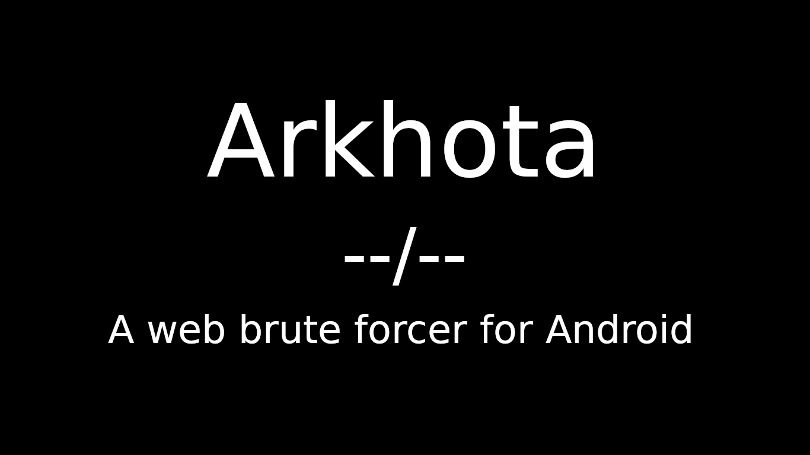

## What?
Arkhota is a web (HTTP/S) brute forcer for Android.

## Why?
A web brute forcer is always in a hacker's computer, for obvious reasons.
Sometimes attacks require to be quick or/and  with minimal device preparation.
Also a phone takes less attention rather than a laptop/computer.
For this situations here's Arkhota.

## Download
You can download APK from [there](https://github.com/ALW1EZ/Arkhota/releases).

## Usage
Explanation is in order of objects in the APK from top to bottom.
#### Banner
- Banner, version & author
You can long click to **version** to see about page.
#### Connection
- URL (required)
An URL to make request.

- Body
You need to specify a body **if** you are going to make a POST request.

#### Userlist / Wordlist
- Userlist selector
_Single: Sets a single username_
_Generate: Generates runtime_
_Wordlists: Sets prepared wordlist_
_Custom wordlist: You can place your custom wordlist to /sdcard/ABF/_
_Then this selector will have it (if required permissions given.)._

- Username box
_You need to specify a username **if you selected Single**._

- Charset selectors
[W] _You need to specify charset, min & max length to generate runtime.
**If you selected Generate**, checkboxes will help you to select._

- Prefix & Suffix
_You can specify prefix & suffix to be added to your username_

#### It's same for the password part too.

#### Configuration
- Beep switch
_Beeps if attack success._

- Fail/Success switch
_Decides how to react connection response_

- POST/GET switch
_Decides type of connection_

- User-Agent
_Sets user-agent for connection.
**if** "Original UA" set, then original user-agent set
**Othervise** given text will set to user-agent_
##### **tip: It has autocomplete for several user-agents, all of them starts with "Mozilla", type and select one if you don't want to expose your original ua, but you don't know what to set**

- Timeout
_Sets timeout for connection, in milliseconds_

- Cookie
_Sets cookie value for connection_

- Regex (required)
_Determines what to look in connection response_

- Empty box
_Tried username:password pairs & result will shown there._

- [W] Start
_Starts attack!_

## Important
URL & Body: **`^USER^` & `^PASS^` are placeholders for username and password.**
You need to place them in url or the body (depends what type you choose to connection)

Regex & Fail/Success switch: These two determines the result of the attack.

If switch points to "Fail", and if given regex found in the response, this means, this is a fail, continue to attack.

if switch points to "Success", and if given regex found in response, this means this is a success!, write result to empty box (in format "FOUND: username:password") and stop the attack.

Copying: Long click on the empty box will copy the content.
if password found, it copies in `username:password` format
Otherwise copies whole content.

If attack is over and unsuccessful, it just stops at the last user:password.

## Screenshots & Videos
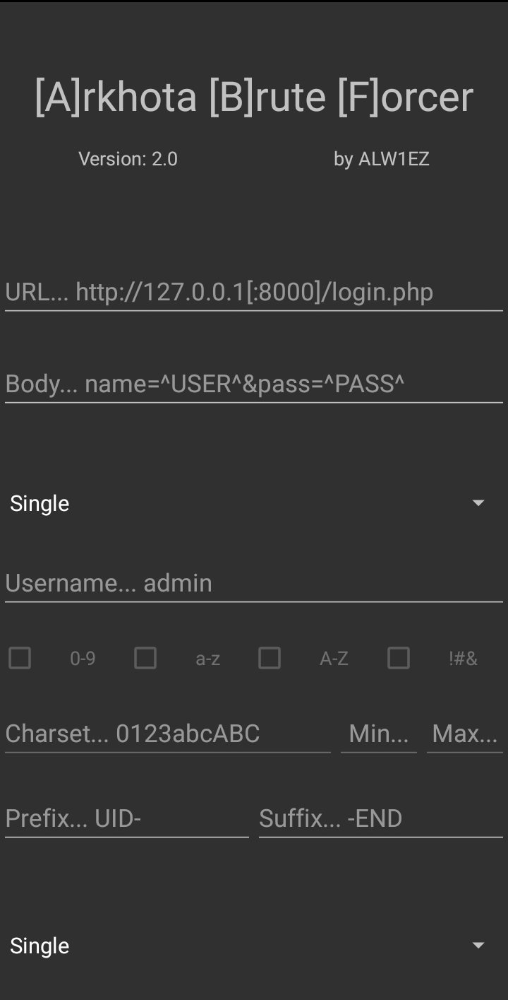
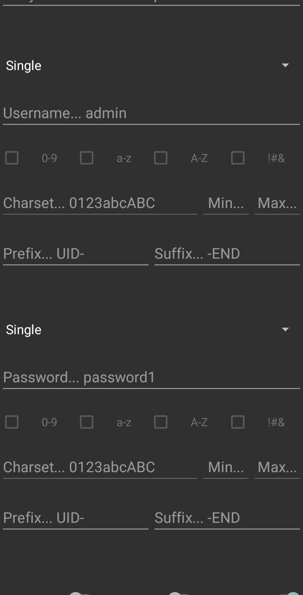
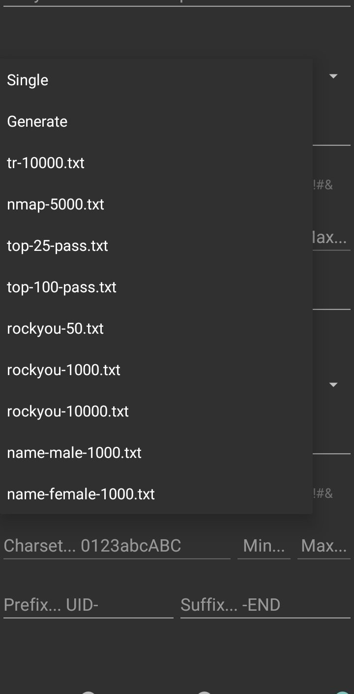
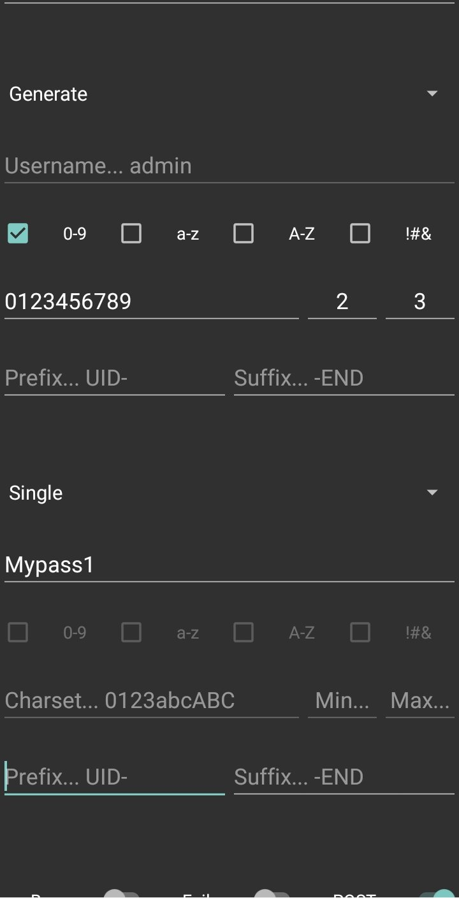
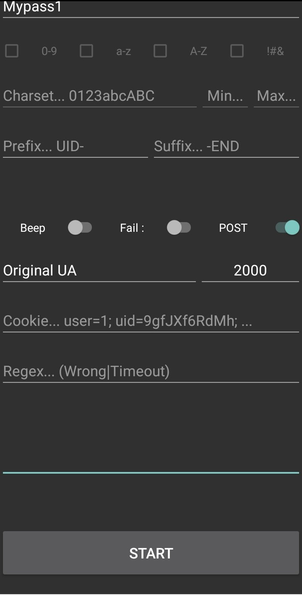
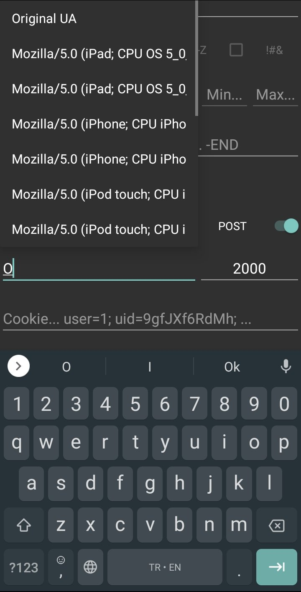
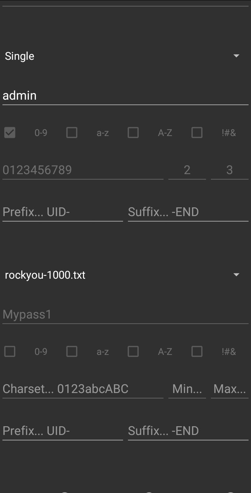
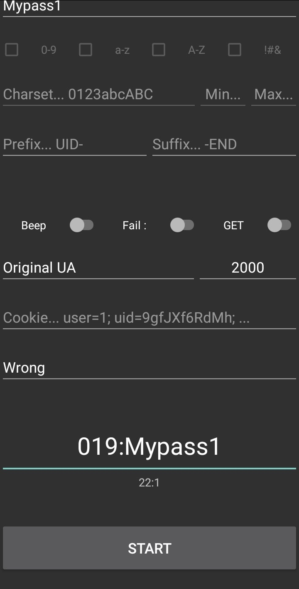
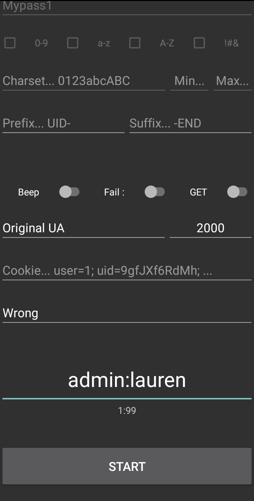
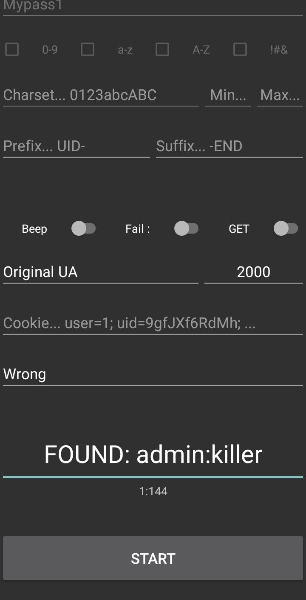
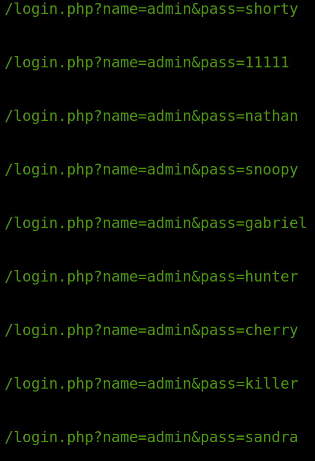

## [W]arning

### Runtime changeable parameters
Every parameter editable during attack, but none of the parameters will changeable during attack, except two. "Fail/Success" and "Beep" switch.

This means:
If you started the attack, and want to change a parameter (e.g charset), editing will not change anything, this changes applies after pressing start button.
BUT
If you started the attack with beep option on, and you want to change it.
You don't need to re-start attack, just click on switch and it won't beep when attack success.

### About "Generate" & Custom wordlists
The Generate option is **NOT** recommended
Runtime generating & parsing is a really hard work for a phone.
Also it's not stable, all possible words will be generated, but may not be sequentially.
If you really need to select it, keep everything minimum.
If your phone freezes or crashes, you know selected options is not suitable your phone's processor.

Do **NOT** place big wordlists to /ABF/ directory.
This will cause freezing & crashing.

And do **NOT** forget standard smartphones have far less processor power rather than a computer, this project is for small and quick attacks.

### About speed
Depends on your speed of network & remote host.

## How to stop the attack
This version of Arkhota doesn't support "stopping the attack".
**BUT** that doesn't mean you cannot stop.
Just change "Fail/Success" switch to opposite direction and wait one more request.
This will cause a false-positive on purpose to stop.
Or
You can simply close and re-open the application.

##### _**PS: I know.. I know... This project gave me a headache, I didn't even try to put a stop button there.**_

